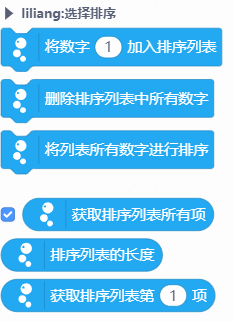

# Gravity IIC Temperature Humidity Sensor DHT20 温湿度传感器


---------------------------------------------------------

## Table of Contents

* [URL](#url)
* [Summary](#summary)
* [Blocks](#blocks)
* [License](#license)
* [Supported targets](#Supportedtargets)

## URL
* Project URL : ```https://github.com/liliang9693/ext-selectionsort```

* Tutorial URL : ```https://mindplus.dfrobot.com.cn/extensions-user```

    


## Summary

此扩展可实现输入数字到列表并排序输出。


## Blocks




## Examples


## License

MIT

## Supported targets

MCU                | JavaScript    | Arduino   | MicroPython    | Remarks
------------------ | :----------: | :----------: | :---------: | -----
noboard        |     √        |              |             | 
arduino        |             |              |             | 
micro:bit        |             |              |             | 
esp32        |             |              |             | 


## Release Logs
* V0.0.1  基础功能完成

